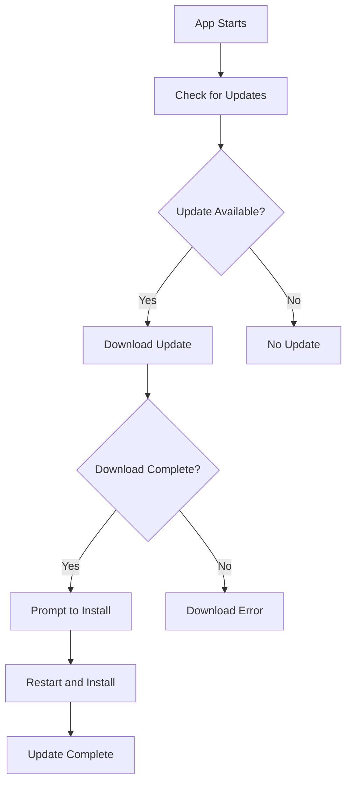

# Akash Share Auto-Update Feature

This document explains how the auto-update functionality works in the Akash Share Electron application.

## Overview

The auto-update feature allows the Akash Share desktop application to automatically check for, download, and install updates without requiring users to manually download and install new versions.

## Implementation Details

### Technologies Used
- **electron-updater**: The official Electron auto-update library
- **Generic Provider**: For local network or custom HTTP server updates
- **NSIS Installer**: For Windows installation with automatic updates

### How It Works

1. **Update Check**: The application checks for updates on startup and periodically while running
2. **Download**: If an update is available, it's downloaded in the background
3. **Install**: Users are prompted to restart the application to install the update
4. **Rollback**: If an update fails, the application can roll back to the previous version

## Configuration

### package.json
The update configuration is set in the `build` section of `package.json`:

```json
{
  "build": {
    "publish": [
      {
        "provider": "generic",
        "url": "http://192.168.0.185:3000/"
      }
    ]
  }
}
```

### Update Server
The application expects updates to be served from a simple HTTP server. You can start the update server with:

```bash
npm run serve-updates
```

This command starts an HTTP server on port 3000 serving the `dist/` directory.

## File Structure for Updates

When you build the application with `npm run dist`, the following files are generated:

```
dist/
├── latest.yml          # Update metadata file
├── Akash Share Setup 1.0.4.exe  # Installer
└── win-unpacked/       # Unpacked application
```

The `latest.yml` file contains version information that the auto-updater uses to determine if an update is available.

## Publishing Updates

### 1. Increment Version Number
Update the version in `package.json`:

```json
{
  "version": "1.0.5"
}
```

### 2. Build the Application
```bash
npm run dist
```

### 3. Serve Updates
```bash
npm run serve-updates
```

### 4. Test Update
Run the previous version of the application and it should detect the update.

## Update Process Flow



## API Reference

### Main Process (electron/main.js)
- `autoUpdater.checkForUpdates()`: Manually check for updates
- `autoUpdater.downloadUpdate()`: Manually download update
- `autoUpdater.quitAndInstall()`: Install update and restart

### Renderer Process (window.electronAPI)
- `window.electronAPI.checkForUpdates()`: Check for updates
- `window.electronAPI.downloadUpdate()`: Download update
- `window.electronAPI.quitAndInstall()`: Install update
- `window.electronAPI.onUpdateStatus(callback)`: Listen for update status changes

### Update Status Events
The update manager emits the following status events:
- `checking`: Checking for updates
- `available`: Update is available
- `not-available`: No updates available
- `downloading`: Downloading update
- `downloaded`: Update downloaded
- `error`: Update error occurred

## UI Components

### UpdateManager Component
Located at `src/components/ui/UpdateManager.js`, this component provides:
- Visual update status indicators
- Download progress bars
- Install prompts
- Error handling

## Testing Updates

### Development Testing
1. Build version 1.0.4: `npm run dist`
2. Save the build somewhere
3. Update version to 1.0.5 in package.json
4. Build again: `npm run dist`
5. Run the 1.0.4 version
6. Start update server: `npm run serve-updates`
7. The 1.0.4 version should detect the 1.0.5 update

### Local Network Testing
1. Ensure both machines are on the same network
2. Find the server machine's IP address
3. Update the publish URL in package.json:
   ```json
   {
     "publish": [
       {
         "provider": "generic",
         "url": "http://YOUR_SERVER_IP:3000/"
       }
     ]
   }
   ```
4. Build and serve updates on the server machine
5. Run the application on the client machine

## Troubleshooting

### Common Issues

1. **Updates Not Detected**
   - Check that the `latest.yml` file is being served correctly
   - Verify the version number in `package.json` is higher than the current version
   - Ensure the update server is running and accessible

2. **Download Failures**
   - Check network connectivity
   - Verify the update server URL is correct
   - Ensure firewall settings allow the connection

3. **Installation Failures**
   - Check that the application has write permissions
   - Verify the installer file is not corrupted
   - Try running the application as administrator

### Debugging Tips

1. Check the Electron console for update logs
2. Verify the `latest.yml` file contents
3. Test the update server URL in a browser
4. Check the application's user data directory for update logs

## Security Considerations

- Updates are served over HTTP by default (consider HTTPS for production)
- The application verifies update integrity
- Updates require user consent before installation
- Code signing should be implemented for production releases

## Customization

### Update Check Frequency
Modify the update check interval in `electron/main.js`:

```javascript
// Check for updates every hour
setInterval(() => {
  if (!isDev) {
    autoUpdater.checkForUpdates();
  }
}, 60 * 60 * 1000);
```

### Custom Update Server
Change the update server URL in `package.json`:

```json
{
  "publish": [
    {
      "provider": "generic",
      "url": "https://your-update-server.com/updates/"
    }
  ]
}
```

## Future Improvements

1. **Code Signing**: Implement code signing for update verification
2. **HTTPS Support**: Use HTTPS for secure update delivery
3. **Differential Updates**: Implement delta updates to reduce download size
4. **Rollback Mechanism**: Enhance rollback capabilities
5. **Update Scheduling**: Allow users to schedule updates